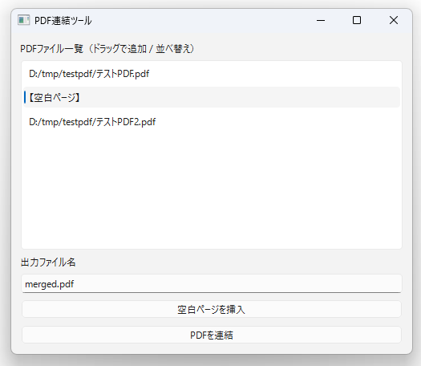
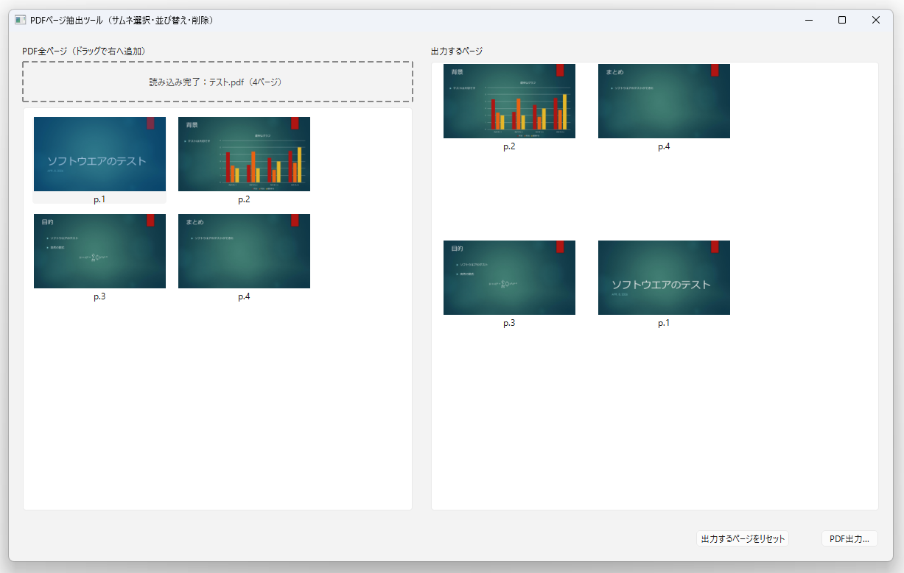

# PDFTools

PDFTools は、複数の PDF を結合したり、PDF からページを抽出・並び替えたりするためのプログラム集です。
本リポジトリでは、ソースコードに加えて、Windows 用の実行ファイル（ビルド済み）も配布しています。

## 機能

### PDFMerger
- 複数の PDF ファイルを 1 つの PDF に結合
- GUI（グラフィカルユーザーインターフェース）による操作が可能

### PDFPagePicker
- PDF ファイルからマウスで必要なページを選択して新しい PDF を作成
- 選択したページの順序を変更することも可能
- GUI（グラフィカルユーザーインターフェース）による操作

## 使い方

### PDFMerger
- 「PDFファイル一覧」の領域に結合したい PDF ファイルをドラッグ＆ドロップ
- 「PDFを結合」ボタンをクリックして、結合された PDF を保存



### PDFPagePicker

- 「ここにPDFをドラッグ＆ドロップ」の領域に PDF ファイルをドラッグ＆ドロップ
- PDF のサムネイルが表示されるので、必要なページをクリックして選択し、右側の「出力するページ」の領域にドラッグ＆ドロップ
- 「出力するページ」の領域で、選択したページの順序を変更したり、不要なページをDeleteキーで削除したりすることが可能
- 「選択したページを保存」ボタンをクリックして、選択したページを新しい PDF として保存



## PDFTools を使用するには、以下の方法があります。

PDFTools は Windows 環境での使用を想定していますが、ソースコードはクロスプラットフォームで動作するように設計されています。

### ビルド済み実行ファイルを使用する場合（Windows）

1. [Releases](https://github.com/nkito/PDFTools/releases/) ページにアクセスします。
2. 最新の Windows 用リリースをダウンロードします。
3. ダウンロードしたアーカイブを展開します。
4. 実行ファイル（`pdfmerger.exe` または `pdfpagepicker.exe`）を起動します。

### ソースコードから実行する場合

1. リポジトリをクローンします：
   ```bash
   git clone https://github.com/nkito/PDFTools.git
   ```
2. プロジェクトディレクトリに移動します：
   ```bash
   cd PDFTools
   ```
3. 必要な依存関係をインストールします：
   ```
   pip install -r requirements.txt
   ```
4. 使用したいスクリプトを実行します：
   ```bash
   python pdfmerger.py
   ```
   または
   ```bash
   python pdfpagepicker.py
   ```

